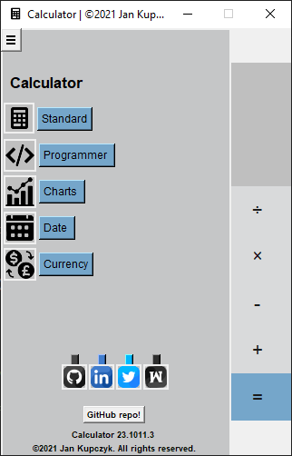
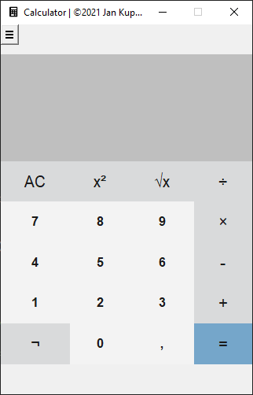
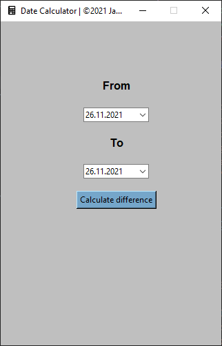
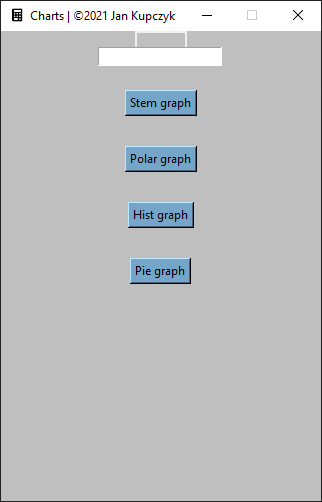

# Calculator

A simple calculator written in python allows you to make simple calculations, writing charts, calculate the dates and exchange currency.

## Installation

Use the package manager [pip](https://pip.pypa.io/en/stable/) to install calculator.

```bash
pip install calculator
```

## Usage

* ```Calculator Menu```



* ```Calculator```



* ```Date Calculator```



* ```Charts```



## Contributing
Pull requests are welcome. For major changes, please open an issue first to discuss what you would like to change.

Please make sure to update tests as appropriate.

## License
[GNU](https://choosealicense.com/licenses/gnu/)
